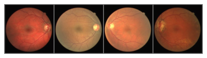
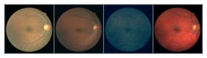

# Score-Based Generative Modelling with SDEs
This repository contains the implementation of score-based generative models with SDEs in PyTorch. 

***

We implement a score-based generative model with SDEs to generate novel digital images of the retina for detecting retinopathy. The models and op folders are incorporated from the GitHub repo of Yang Song [link to repo](https://github.com/yang-song/score_sde_pytorch).

### Results:

We observe that the sampler generates high quality samples comparable to the retinal dataset images. 
The sampler takes 2000 steps to generate these images. 

|Original Retinal Images |
|:---:|
| |

|Generated Retinal Images |
|:---:|
| |

### Dataset
The model was trained on the Digital Retinal Images for Vessel Extraction dataset [link](https://drive.grand-challenge.org/).

### Training
To set the parameters, edit the config.py file in the configs folder.  
The jupyter notebook implementation(main.ipynb) can be used to either train the model further or generate more samplers. 

###

### Score-Based GM with SDEs Paper
Score-Based Generative Modeling through Stochastic Differential Equations by Yang Song, Jascha Sohl-Dickstein, Diederik P. Kingma, Abhishek Kumar, Stefano Ermon, and Ben Poole

```
@inproceedings{
  song2021scorebased,
  title={Score-Based Generative Modeling through Stochastic Differential Equations},
  author={Yang Song and Jascha Sohl-Dickstein and Diederik P Kingma and Abhishek Kumar and Stefano Ermon and Ben Poole},
  booktitle={International Conference on Learning Representations},
  year={2021},
  url={https://openreview.net/forum?id=PxTIG12RRHS}
}
